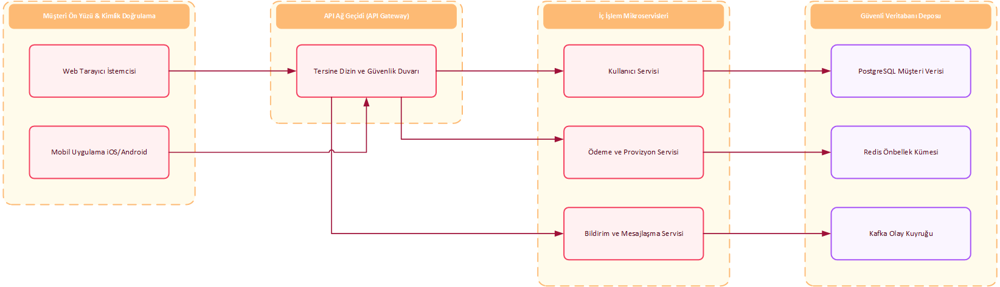
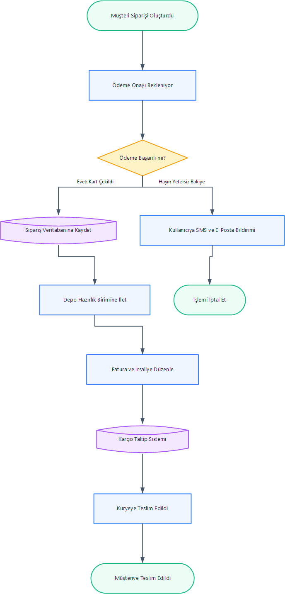
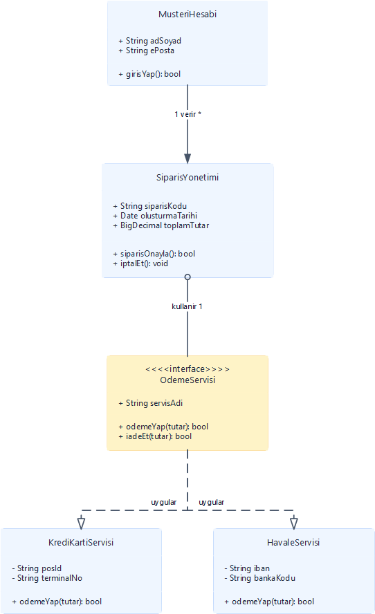
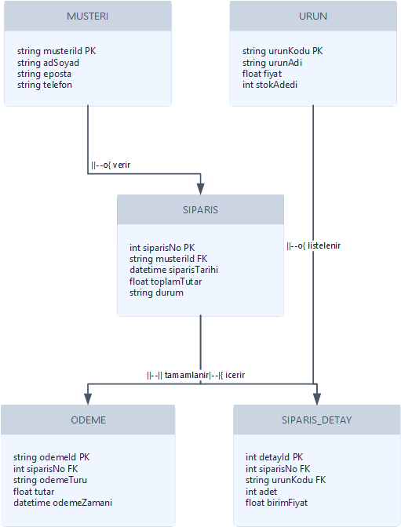
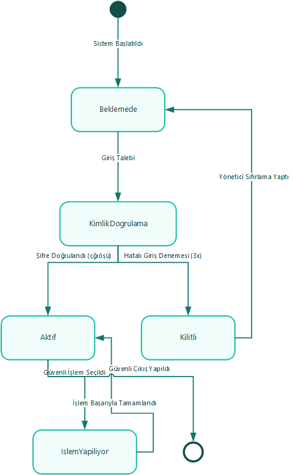
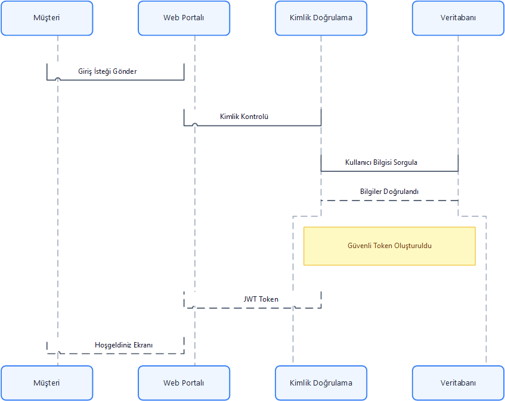

# Mermaid to Microsoft Visio (.vsdx) Converter
### Enterprise-Grade Native Headless Compiler & Desktop Application

A robust, enterprise-grade tool that converts **Mermaid diagrams** (Flowcharts, Sequence diagrams, UML Class diagrams, Entity-Relationship diagrams, and State machines) into professional, beautifully styled **Microsoft Visio (`.vsdx`)** vector drawings with **100% Turkish character fidelity**, automated visual verification screenshots, and dynamic connector routing.

Featuring a **Dual-Engine Architecture**:
1. **Native Headless OPC Compiler Engine (`--engine native`, Default)**: Pure Python implementation that builds standard Open Packaging Conventions `.vsdx` ZIP packages directly without requiring Microsoft Visio or Windows COM Interop. Runs cross-platform on Windows, Linux, macOS, and in CI/CD containers.
2. **Visio COM Automation Engine (`--engine com`)**: Direct automation of Microsoft Visio Desktop on Windows via `win32com.client` for interactive canvas manipulation and high-DPI verification screenshots (`--verify`).

<p align="center">
  
</p>

---

## 📸 Visual Showcase & Generated Visio Drawings

Every diagram below is natively compiled into a real Microsoft Visio (`.vsdx`) drawing with parametric vector shapes, orthogonal dynamic connectors, and crisp Unicode typography:

| Microservices Architecture (Subgraphs) | E-Commerce Workflow (Flowchart) |
| :---: | :---: |
|  |  |

| UML Class Hierarchy | Entity-Relationship (ER) Model |
| :---: | :---: |
|  |  |

| State Machine Transition | Sequence Diagram |
| :---: | :---: |
|  |  |

---

## 🤖 AI Agent Skill Integration (`SKILL.md`)

This repository is equipped with an **AI Agent Skill** formatted for autonomous agents (such as **Antigravity**, **Claude Code**, **Cursor**, **Copilot**, and **LangChain**).

The complete agent instructions and protocol are available in:
- **Root Specification**: [`SKILL.md`](SKILL.md)
- **Modular Skill Folder**: [`skills/mermaid-to-visio/SKILL.md`](skills/mermaid-to-visio/SKILL.md)

### What Agents Can Do:
1. **Autonomous Diagram Ingestion**: Extract ```` ```mermaid ```` code blocks directly from markdown documentation.
2. **Zero-Dependency Headless Compilation**: Run `--engine native` in any cloud container, Linux server, or local environment without Microsoft Office.
3. **Agentic Visual Verification Loop**: When Visio is present, invoke `--verify` to render a 300-DPI PNG screenshot into `verification_output/` and inspect layout accuracy using image inspection tools before completing tasks.
4. **Professional Themes & Fonts**: Select appropriate palettes (`Modern Corporate`, `Emerald Tech`, `Sunset Coral`, `Minimalist Slate`, `Grayscale Clean`) and TrueType fonts (`Segoe UI`, `Calibri`, `Arial`).

```powershell
# Headless compile from any agent environment
python main.py diagram.mmd -o output/diagram.vsdx --engine native --palette "Modern Corporate (Blue & Slate)"

# With visual verification (Windows + Visio)
python main.py diagram.mmd -o output/diagram.vsdx --verify
```

---

## 🌟 Key Features

1. **Enterprise Headless `.vsdx` Compiler (Zero Visio Required)**:
   - **Open Packaging Conventions (OPC)**: Directly builds valid ZIP container packages (`[Content_Types].xml`, `_rels/.rels`, `docProps/`, `visio/document.xml` with standard StyleSheets, `windows.xml`, and `pages/page1.xml`).
   - **Calibrated Text Metrics**: Headless typographical layout estimating text bounds for Latin and Turkish character classes, proportional font scaling, and multi-line wrapping.
   - **Sugiyama Hierarchical Layout**: Deterministic graph layout engine with cycle removal (DFS back-edge reversal), longest-path rank assignment, barycentric crossing reduction, and coordinate inversion.
   - **Parametric ShapeSheet XML**: 14 standard node geometry primitives (rectangles, rounded, stadiums, diamonds, cylinders, subroutines, hexagons, parallelograms, trapezoids, circles) with evaluated physical coordinates and dynamic formulas.
   - **Dynamic Glue Topologies**: Generates page-level `<Connects>` records binding connectors to shapes for dynamic re-routing.

2. **Robust Mermaid AST Parser & Markdown Ingestion**:
   - **Markdown Document Ingestion**: Seamlessly reads `.md` and `.markdown` files, automatically extracting ```` ```mermaid ```` diagrams while discarding surrounding markdown prose.
   - **Flowcharts**: Supports directions (`TD`, `TB`, `LR`, `RL`, `BT`), all standard shapes (Rectangles `[]`, Rounded `()`, Stadiums `([])`, Subroutines `[[]]`, Cylinders/Databases `[()]`, Circles `(())`, Diamonds/Rhombus `{}`, Hexagons `{{}}`, Parallelograms `[/\]`), connector styles (`-->`, `---`, `-.->`, `==>`), edge labels (`|label|` and `-- label -->`), and independent collision-free `subgraph` containers.
   - **Sequence Diagrams**: Supports `participant`, `actor`, aliases (`as`), directional messages (`->>`, `-->>`, `->`, `-->`, `-x`, `--x`), notes (`Note over`, `Note left/right of`), and title headers.
   - **UML Class Diagrams**: Full support for `classDiagram`, multi-compartment class shapes (class title, stereotypes like `<<interface>>`, attributes, and methods), member visibility (`+`, `-`, `#`, `~`), and 8 UML relationship connectors (`<|--`, `<|..`, `*--`, `o--`, `-->`, `..>`, `--`, `..`).
   - **State Diagrams**: Full native support for `stateDiagram` and `stateDiagram-v2` with initial states `[*]`, terminal bullseyes, rounded state shapes, and action transitions.
   - **Entity-Relationship Diagrams**: Full native support for `erDiagram` with multi-compartment entity tables, primary/foreign key (`PK`/`FK`) attribute markers, and cardinality relationships.
   - **Point-to-Point Glue & Line Jumps**: Active ShapeSheet glue with named connection points (`Top`, `Bottom`, `Left`, `Right`), strict `NoFill` styling, and automatic semicircular bridge arcs for intersecting orthogonal lines.
   - **Precise Error Diagnostics**: Reports exact line numbers and code snippets on malformed syntax, highlighting the error directly in the editor.

3. **100% Turkish Character Support**:
   - Impeccable handling of all Turkish lowercase and uppercase characters: **`ç, ğ, ı, ö, ş, ü, İ, Ç, Ğ, Ö, Ş, Ü`**.
   - UTF-8 normalization (NFC) across input reading, AST generation, and Visio COM string marshaling.
   - Explicitly assigns Unicode TrueType fonts (**`Segoe UI`**, **`Calibri`**, **`Arial`**) at the ShapeSheet level to guarantee no glyph fallback, broken question marks (`?`), or empty square boxes (`□`).

4. **Visual Verification & High-Resolution Screenshot Capture**:
   - When running on Windows with Visio installed, verify generated `.vsdx` files by triggering a layout pass and exporting the canvas to a high-DPI PNG image (`Page.Export()`).
   - Automatically saves timestamped verification images in `verification_output/`.
   - Validates image dimensions, file size, and render performance using Pillow.

5. **Modern Windows 11 Desktop GUI**:
   - Dual-pane layout: Monospace Mermaid code editor with synchronized line numbers on the left, interactive zoomable/pannable verification screenshot preview on the right.
   - Preset selector with rich Turkish flowchart, subgraph architecture, decision tree, sequence diagram, and UML class diagram templates.
   - Direct file loading for `.mmd`, `.txt`, `.md`, and `.markdown`.
   - Customizable color palettes (Modern Corporate, High Contrast Dark, Oceanic Breeze, Minimalist Pastel, Grayscale Technical) and Unicode fonts.
   - Real-time logging console and progress indicator.
   - "Open in Visio" button to inspect the generated `.vsdx` in Microsoft Visio with a single click.
   - Fluent theme integration (`sv-ttk`) with Dark and Light mode toggle.

---

## 📋 System Requirements

- **Operating System**: Windows 10 or Windows 11 (64-bit recommended)
- **Python**: Python 3.10 or newer
- **Microsoft Visio**: Visio 2016, Visio 2019, Visio 2021, or Microsoft 365 Visio (locally installed and activated)

---

## 🚀 Quick Start

### 1. Installation

Clone or extract the repository, then install the dependencies:

```powershell
python -m pip install -r requirements.txt --trusted-host pypi.org --trusted-host files.pythonhosted.org
```

Dependencies in `requirements.txt`:
- `pywin32>=306`: Microsoft Visio COM automation interface.
- `pillow>=10.0.0`: Image processing and high-resolution preview canvas.
- `sv-ttk>=2.6.0`: Modern Windows 11 Fluent theme for Tkinter.

### 2. Launch the Desktop Application

Double-click `run.bat` or execute:

```powershell
python main.py
```

---

## 🖥️ Using the Desktop GUI

1. **Select a Preset or Enter Mermaid Code**:
   - Use the **"Örnek Şablonlar"** dropdown to load sample diagrams (e-commerce flows, microservices with subgraphs, 2FA sequence diagrams, credit decision trees, or Turkish alphabet tests).
   - Or paste your own Mermaid syntax directly into the code editor.
2. **Configure Styling**:
   - **Renk Paleti**: Select from *Modern Corporate (Blue & Slate)*, *Emerald Tech (Mint & Teal)*, *Sunset Coral & Violet*, *Minimalist Slate*, or *Grayscale Clean (Black & White)*.
   - **Unicode Yazı Tipi**: Choose *Segoe UI* (recommended), *Calibri*, or *Arial*.
3. **Generate & Verify**:
   - Click **"🚀 Visio'ya Dönüştür (.vsdx)"**.
   - The app parses the AST, invokes Visio COM in the background, applies styling and connector routing, saves the `.vsdx` into `output/`, and exports a high-resolution screenshot into `verification_output/`.
4. **Interactive Preview**:
   - The right panel displays the verified rendering immediately.
   - Use **Yakınlaştır (+)**, **Uzaklaştır (-)**, **Ekrana Sığdır (Fit)**, or drag with the mouse to pan across large diagrams.
5. **Open in Visio**:
   - Click **"📂 Çizimi Visio'da Aç"** to launch the file directly in Microsoft Visio.

---

## 💻 Headless CLI Mode

The application can also be run headlessly from the command line for automated workflows or CI/CD pipelines:

```powershell
# Convert a Mermaid file (.mmd or .txt) to Visio with automatic visual verification
python main.py input_diagram.mmd -o output/diagram.vsdx --verify

# Extract Mermaid code block directly from a Markdown document (.md)
python main.py documentation.md -o output/architecture.vsdx --verify

# Black & White / Grayscale publication theme
python main.py input_diagram.mmd -o output/diagram.vsdx --palette "Grayscale Clean (Black & White)" --verify

# Choose a specific palette and font
python main.py input_diagram.mmd -o output/diagram.vsdx --palette "Emerald Tech (Mint & Teal)" --font "Calibri" --verify

# Specify a custom screenshot output path
python main.py input_diagram.mmd -o output/diagram.vsdx --screenshot verification_output/my_diagram.png
```

### CLI Arguments:

| Argument | Description | Default |
| :--- | :--- | :--- |
| `input` / `-i` | Path to the input `.mmd`, `.txt`, `.md`, or `.markdown` file. If omitted, GUI opens. | Optional |
| `-o, --output` | Destination `.vsdx` file path. | `<input_basename>.vsdx` |
| `--engine` | Engine type: `native` (pure Python headless OPC compiler, zero Visio required) or `com` (Visio COM automation). | `native` |
| `-p, --palette` | Theme: `Modern Corporate (Blue & Slate)`, `Emerald Tech (Mint & Teal)`, `Sunset Coral & Violet`, `Minimalist Slate (Dark / Steel)`, `Grayscale Clean (Black & White)`. | `Modern Corporate` |
| `-f, --font` | Unicode-safe font family: `Segoe UI`, `Calibri`, `Arial`. | `Segoe UI` |
| `--verify` | Triggers Visio canvas export and verification screenshot (requires Visio on Windows). | `False` |
| `-s, --screenshot` | Explicit file path for the verification screenshot PNG. | Auto timestamped |
| `--verification-dir` | Output folder for verification screenshots. | `verification_output` |

---

## 🧪 Running Automated Tests

Run the full unit and integration test suite:

```powershell
python -m unittest discover -s tests -p "test_*.py" -v
```

The test suite validates:
1. **`test_opc_compiler.py`**: Pure headless unit tests verifying Open Packaging Conventions (OPC) XML structure, dynamic connects, Sugiyama layout, text metrics, and palettes without needing Visio.
2. **`test_parser.py`**: Flowchart node shapes, arrow types, edge labels, subgraphs, sequence lifelines, UML class diagrams, and syntax error detection.
3. **`test_turkish_encoding.py`**: Turkish character normalization, HTML entities, and ShapeSheet formula escaping.
4. **`test_visio_generation.py`**: End-to-end integration tests that generate `.vsdx` files via Visio COM and capture verification screenshots.

---

## 🏗 Architecture & Code Structure

```text
mermaid-to-vsdx/
├── src/
│   ├── compiler/                 # 100% Headless Native .vsdx Compiler (Pure Python)
│   │   ├── __init__.py           # Compiler facade (compile_mermaid_to_vsdx)
│   │   ├── text_metrics.py       # Typographical layout & character sizing heuristics
│   │   ├── layout_engine.py      # Sugiyama hierarchical layout & coordinate transforms
│   │   ├── shapesheet.py         # Visio ShapeSheet XML templates & 14 vector primitives
│   │   ├── opc_package.py        # Open Packaging Conventions (OPC) ZIP packaging
│   │   ├── flowchart_compiler.py # Flowchart & subgraph XML compilation
│   │   ├── sequence_compiler.py  # Sequence diagram lifelines, messages & notes compilation
│   │   └── class_compiler.py     # Multi-compartment UML class diagram compilation
│   │
│   ├── parser/
│   │   ├── __init__.py           # Unified parser interface (parse_mermaid, extract_mermaid_from_markdown)
│   │   ├── ast_nodes.py          # Dataclass models for Flowchart, Sequence & Class ASTs
│   │   ├── base_parser.py        # Tokenizer, markdown extractor & MermaidParseError
│   │   ├── flowchart_parser.py   # Flowchart parser (shapes, edges, subgraphs)
│   │   ├── sequence_parser.py    # Sequence parser (participants, messages, notes)
│   │   └── class_parser.py       # UML Class parser (compartments, members, relationships)
│   │
│   ├── visio/                    # Desktop Visio COM Automation Engine (Windows)
│   │   ├── __init__.py           # Converter facade (convert_mermaid_to_visio)
│   │   ├── com_client.py         # VisioSession STA manager, C2R launch & lifecycle
│   │   ├── palettes.py           # Color palette themes (Corporate, Emerald, Coral, Slate, Grayscale)
│   │   ├── shapes.py             # Visio shape geometry, text centering, font assignment
│   │   ├── flowchart_builder.py  # Layer-based layout, subgraphs, connector routing
│   │   ├── sequence_builder.py   # Lifelines, upright message lines, activation notes
│   │   └── class_builder.py      # UML Class compartment rendering & connectors
│   │
│   ├── verifier/
│   │   ├── __init__.py
│   │   └── screenshot.py         # Visio Page.Export high-DPI canvas capture & Pillow check
│   │
│   ├── gui/
│   │   ├── __init__.py
│   │   ├── app_window.py         # Windows 11 Fluent GUI application
│   │   ├── code_editor.py        # Editor widget with line numbers & error markers
│   │   ├── image_preview.py      # Interactive zoom/pan verification preview canvas
│   │   └── samples.py            # Rich Turkish Mermaid diagram presets
│   │
│   └── utils/
│       ├── __init__.py
│       └── unicode_helper.py     # Turkish char analysis, NFC normalization, font helpers
│
├── tests/
│   ├── test_opc_compiler.py      # Headless native compiler unit tests (zero Visio)
│   ├── test_parser.py            # AST unit tests
│   ├── test_turkish_encoding.py  # Turkish character encoding tests
│   └── test_visio_generation.py  # Visio COM integration tests
│
├── assets/                       # High-resolution showcase diagram screenshots
├── skills/                       # Modular AI Agent skill package
│   └── mermaid-to-visio/
│       └── SKILL.md
├── main.py                       # Application entrypoint (GUI + CLI)
├── run.bat                       # One-click Windows 11 launcher
├── run.ps1                       # PowerShell launcher
├── requirements.txt              # Pip dependencies
├── SKILL.md                      # AI Agent Skill specification
├── LICENSE                       # MIT License
└── README.md                     # Documentation
```

---

## 🛡️ Error Handling & Troubleshooting

- **Running Without Microsoft Visio**: Use `--engine native` (the default). It uses pure Python to build the `.vsdx` file and does not require Microsoft Office or Windows COM Interop.
- **"Microsoft Visio Bulunamadı" (When using `--engine com` or `--verify`)**: Ensure Microsoft Visio is installed on the machine. The application checks Windows Registry CLSIDs (`Visio.Application` / `Visio.InvisibleApp`) and standard Office 16 Program Files directories.
- **Malformed Mermaid Syntax**: The editor highlights the faulty line with an indicator and reports the specific syntax issue.
- **COM Apartment Issues**: All COM calls run within Python Single-Threaded Apartments (`pythoncom.CoInitialize()` / `CoUninitialize()`), ensuring thread safety and preventing UI freezing.

---

## 📄 License & Trademark Notice

Distributed under the **MIT License**. See [`LICENSE`](LICENSE) for more information.

### Trademark Notice
- Microsoft, Microsoft Visio, and Windows are registered trademarks or trademarks of Microsoft Corporation in the United States and/or other countries.
- Mermaid is a trademark/open-source project created by Knut Sveidqvist and contributors.
- This project is an independent open-source tool and is not affiliated with, endorsed by, sponsored by, or associated with Microsoft Corporation or Mermaid.

